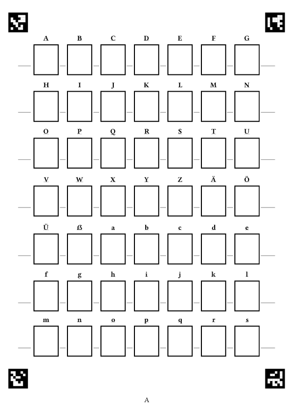
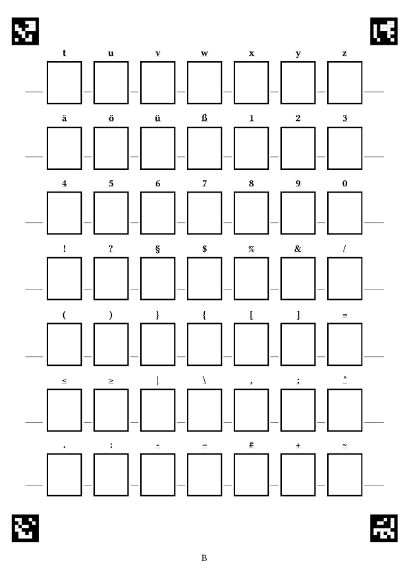
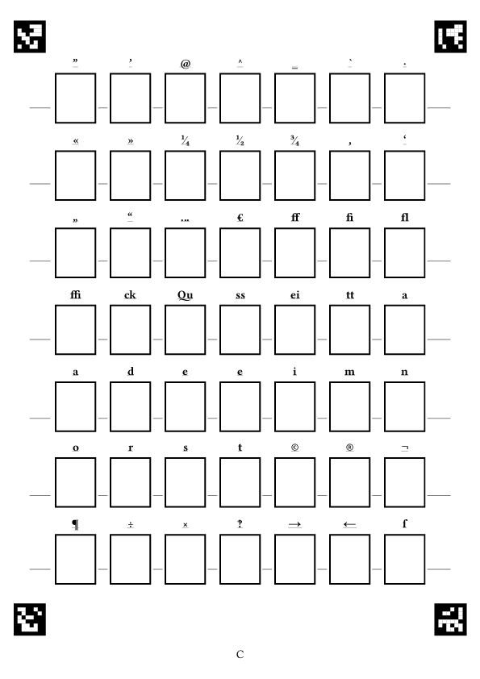
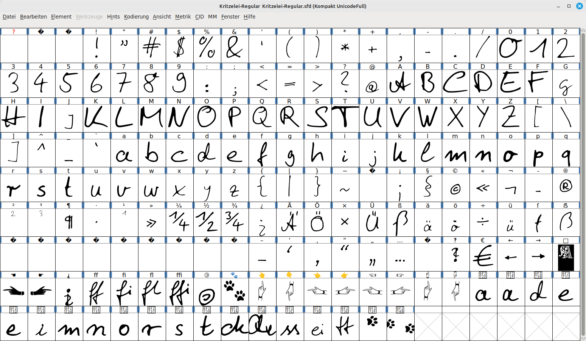

[//]: # (
  pandoc --from=markdown README.md \
  --to=html5 --output=index.htm -s \
  --include-in-header=template/Kritzelei-wird-Schrift-meta.htm
  )

# *Kritzelei wird Schrift*

Weiterentwicklung von [Hand2Font](https://maybegeek.github.io/Hand2Font/).

Von handgekritzelten Zeichen zum weiterbearbeitbaren Font. Drei Blatt mit je 49 Kästchen stehen bereit für die jeweiligen Zeichen. Sind die Kästchen ausgefüllt, können die Bögen per Foto oder Scan umgewandelt werden.

* Wichtig hierbei ist, die Kästchen dürfen von den beinhalteten Zeichen nicht berührt oder durchbrochen werden.
* Die vier Randmarken müssen auf dem Bild/Scan ebenfalls vollständig vorhanden sein.
* Bei ungünstiger Belichtung oder ungünstig (kontrastarmer) Papierfarbe-Schriftkombination kann jederzeit mittels eines Bildbearbeitungsprogramms -- in einem Zwischenschritt -- per `threshold`/Schwellwert eine Umwandlung in Schwarz-Weiß manuell durchgeführt werden und die Erkennung in den nächsten Schritten dadurch verbessert werden.
* Als Zielformat benötigen wir Bilddateien im Format `*.jpg`.
* Das Namensmuster ist `A.jpg`, `B.jpg` und `C.jpg`.
* Falls Sie die Umwandlung von jemand anderem Durchführen lassen notieren Sie noch in einer Datei `Schriftname.txt` den Wunschnamen der Schrift.

Für die Weiterverarbeitung gibt es ein Skript zum Entzerren und Zuschneiden der Glyphen-Vorlage. Hernach werden die Kästchen per `opencv` erkannt, der Inhalt der Boxen dann ausgeschnitten und die vorliegenden Einzelbilder der Kästcheninhalte in `*.ppm`-Dateien umgewandelt um diese dann per `potrace` zu vektorisieren. Die erstellten `*.svg`-Dateien werden im nächsten Schritt an vorgesehenen Positionen im `Font` platziert und eine `*.sfd`-Datei erstellt.

Die automatische Umwandlung der Zeichen soll einige Schritte bei der Erstellung einer eigenen Schrift mit `Fontforge` beschleunigen. Es wartet auf jeden Interessierten aber noch genügend (Fein-)Arbeit bei der Verbesserung der automatisch erstellten `*.sfd`-Datei.

## Kritzelei-Zeichenvorlage

::: {.glyphenvorlage}

:::

::: {.download}

[Kritzelei-Zeichenvorlage.pdf](https://maybegeek.github.io/Kritzelei-wird-Schrift/Kritzelei-Zeichenvorlage/Kritzelei-Zeichenvorlage.pdf){.button}

:::

## magic

Bei der Erstellung des Fonts werden bzgl. der eigenen Zeichen noch weitere Einstellungen und Umwandlungen vorgenommen:

* der Zeichensatz festgelegt: `UnicodeFull`
* Versionsnummer für den Font vergeben: `1.0`
* font weight: `Regular`
* `fontname`, `familyname` und `fullname`
* `font.comment = 'FONT_COMMENT'`
* `font.copyright = 'FONT_LICENSE'`
* em-size: `2048`
* Layers: `cubic`
* `stylistic sets`
* `liga`, normale Ligaturen
* `dlig`, discretionary ligatures
* besondere Leerzeichen
* Katzenpfoten!
* `.notdef`-Quisquilie
* side bearings
* Größenanpassung ... automagisch
* Grundlinien- x-Höhen-Anpassung

## Nutzung

In den Ordner `Kritzelei-Bilder-Original` kommen die Fotos/Scans der ausgefüllten `Kritzelei-Zeichenvorlage`.

Inhalt dann dort:

* `Kritzelei-Bilder-Original/A.jpg`
* `Kritzelei-Bilder-Original/B.jpg`
* `Kritzelei-Bilder-Original/C.jpg`

Mittels `python3 Kritzelei-Bilder-Vorbereitung.py -s Kritzelei-Bilder-Original` wird dann der Ordner nach jpg-Dateien inspiziert und die drei Dateien im Ordner `Kritzelei-Bilder-Vorbereitung` beschnitten und entzerrt abgelegt.

Möglicher Inhalt dort:

* `Kritzelei-Bilder-Vorbereitung/A.jpg`
* `Kritzelei-Bilder-Vorbereitung/B.jpg`
* `Kritzelei-Bilder-Vorbereitung/C.jpg`

Auch die einzelne Umwandlung per `python3 Kritzelei-Bilder-Vorbereitung.py -f A.jpg` ist möglich, der Dateiname ist dann auf den Ordner `Kritzelei-Bilder-Original` bezogen.

Wollen wir nachsehen, ob die Glyphen in den jeweiligen Kästen ordentlich und in ordentlicher Reihenfolge erkannt werden -- das ist ja durchaus sehr wichtig für den nächsten Schritt -- so können wir dies mit `python3 Kritzelei-Bilder-Fehlersuche.py -s Kritzelei-Bilder-Vorbereitung` tun.

Hier werden uns dann in einem kleinen Fenster die Originaldatei und das Erkannte angezeigt. Mit `ESC` können wir die kleinen Darstellungen jeweils Bestätigen und so Durchschalten.

Passt dies, geht es weiter. Grundlegend hier zwei Aufrufe, weitere Einstellmöglichkeiten kann man vorerst der Hilfe innerhalb des Skripts entnehmen, oder bei Durchsicht des Skripts selbst sehen und ändern:

Hier also die vorbereiteten Bilder aus `Kritzelei-Bilder-Vorbereitung` holen (A,B,C) und in den Ordner `Output/Kritzelei-01` mit Schriftnamen `Kritzelei-01` hinein umwandeln ... die Glyphenbilder, deren Umwandlung und eine weiterverwendbare `.sfd` erzeugen. Schwellwerte für Strichdicke, Unreinheiten usw. könnten ebenfalls noch verwendet werden. `--rmppm`, `--rmsvg` oder `--rmjpg` entfernt nämliche Zwischenschrittdateien.

`python3 Kritzelei-wird-Schrift-Scan2SVG.py --scans Kritzelei-Bilder-Vorbereitung/ -o Output/Kritzelei-01 -n Kritzelei-01 --rmppm`

Ein bisschen mit den Optionen wird man schon spielen müssen, hier eine Variante, welche gerade bei bestimmten Stiftverwendungen und Stiftfarbenverwendungen erfolgreich ist. Aber auch hier nochmals der Hinweis, dass eine vorherige Bearbeitung hin zu kontrastreichem schwarz/weiß im Bildbearbeitungsprogramm hilfreich ist.

`python3 Kritzelei-wird-Schrift-Scan2SVG.py --scans Kritzelei-Bilder-Vorbereitung/ -o Output/Kritzelei-02 -n Kritzelei-02 --rmppm --buntstift`

`-t 160`: Schwellwert hinsichtlich der Umwandlung (Kastenerkennung). Zwischen 0 und 255, wobei ich für den Standard ca. um die 160 vorschlagen würde.

`-o Ordner`: Ordnername und Ziel, in welchem die Dateien abgelegt werden.

`-n KritzeleiFont`: Wie soll der Font später heißen?

`--rmppm`: *.ppm-Dateien im Erstellungsordner entfernen.

`--rmjpg`: *.jpg-Dateien im Erstellungsordner entfernen.

`--rmsvg`: *.svg-Dateien im Erstellungsordner entfernen.

`--buntstift`: bei Buntstift, Farbe, uneinheitlicher Deckkraft, ... (resultiert in Verwendung von `--blacklevel 0.96`)

`--ptdefault`: statt `--buntstift`. Führt zu genauerer Umsetzung.

## Ergebnis in FontForge

## Download

Hierzu am besten auf der [github-Seite zu Kritzelei wird Schrift](https://github.com/maybegeek/Kritzelei-wird-Schrift) die Projektdaten herunterladen:

::: {.download}

[Projektdateien für *Kritzelei wird Schrift* herunterladen](https://github.com/maybegeek/Kritzelei-wird-Schrift/archive/refs/heads/main.zip){.button}

:::

## notwendige Pakete

* python3
* python3-skimage
* potrace
* libfontforge3
* python3-fontforge
* python3-opencv
* python3-matplotlib

Viel Vergnügen & happy fonting,  
Christoph Pfeiffer
